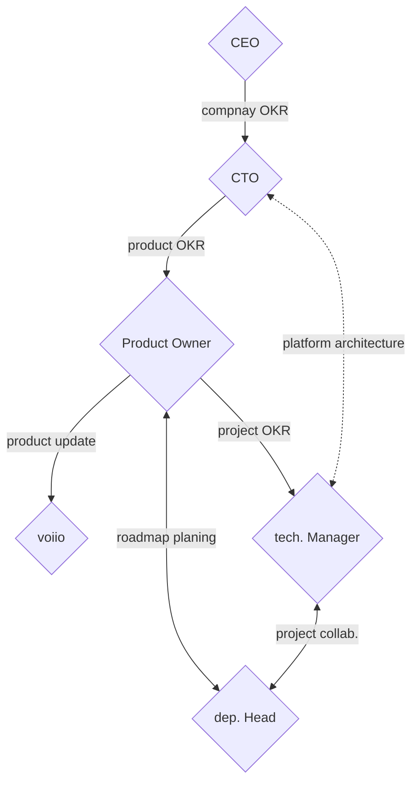

# Team Structure

## Org Chart & Interfaces

## Artifacts & Ownership

### Visions

A clear vision needs to be set for the company and all departments. Those documents
need to be shared with all employees.

### OKR

_ORK = Objective Key Result_

We use OKRs as a bidirectional communication, with goal alignment in the form of
objectives and impactful delivery in form of key results. They must be agreed upon
by both the team and manager.

ORKs are communicated within the company to identify synergies or conflicts of interest.

#### Objectives

Objectives are set by the manager in alignment with the company or product vision.
They are their main tool of control and need to be highly specific and achievable.
Objectives may change over time, to allow the manager to set the focus on new challenges.

#### Key Results

Key results are committed output on the objective set by the manager.
They must be achievable by the team without external dependencies or side effects.
Should a team struggle to define key results, this might indicate that the manager
needs to set a more refined objective.

### Product Roadmap

The product roadmap help organize and communicate individual product ORKs for the
upcoming month. The document is owned and maintained by the product owner.

The product owner does not define a timeline based on estimates or solutions, but based
on amount of time they want to invest to achieve an objective.

The product owner must frequently update and align the roadmap with relevant stakeholders.

### Project

The project is owned by a technical manager. They are responsible for the project's
outcome. They gather requirements, define solution, and coordinate the team.

They product manager must frequently update and align the project with relevant stakeholders.
